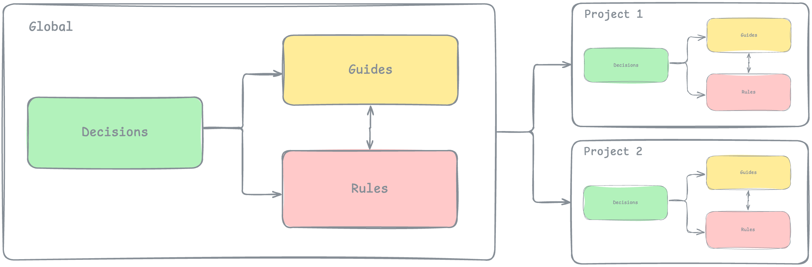

# context1000: Architectural Artifacts for AI



A strict documentation format designed exclusively for AI agents. Four artifact types capture both the "why" behind decisions and the resulting rules and instructions.

## Structure

```sh
.context1000/
├── intro.md                  # Introduction and overview
├── decisions/                # Why we chose this approach
│   ├── adr/                  # Architectural Decision Records (implementation details)
│   │   └── example.adr.md
│   └── rfc/                  # Request for Comments (proposals and options)
│       └── example.rfc.md
├── rules/                    # What must and must not be done (imperatives derived from decisions)
│   ├── example1.rules.md
│   └── subdirectory/         # Subdirectories supported for organization
│       └── example2.rules.md
├── guides/                   # How to implement and use (practical instructions)
│   ├── example1.guide.md
│   └── subdirectory/         # Subdirectories supported for organization
│       └── example2.guide.md
└── projects/                 # Project-specific documentation (only projects, no subdirectories)
    ├── project1/
    │   ├── project.md        # Project overview
    │   ├── decisions/        # Project-specific ADRs and RFCs
    │   │   ├── adr/
    │   │   └── rfc/
    │   ├── rules/            # Project-specific rules
    │   │   └── subdirectory/ # Subdirectories supported
    │   ├── guides/           # Project-specific guides
    │   │   └── subdirectory/ # Subdirectories supported
    │   └── projects/         # Nested sub-projects
    │       └── subproject1/
    │           ├── project.md
    │           ├── decisions/
    │           ├── rules/
    │           └── guides/
    └── project2/
        ├── project.md
        ├── decisions/
        │   ├── adr/
        │   └── rfc/
        ├── rules/
        │   └── subdirectory/
        └── guides/
            └── subdirectory/
```

## Artifact Types

### Decisions

Capture the "why" behind choices using well-known formats:

- **RFC**: Proposals outlining solution options and constraints
- **ADR**: Implementation details of chosen directions

### Rules

Imperatives derived from decisions. State what must/must not be done. Reference related RFCs/ADRs for context.

### Guides

Implementation and usage details. Reference decisions and rules. Cover installation, usage, architecture overviews, and conventions.

### Projects

Self-contained documentation following the same structure. Each project includes decisions, rules, guides, and a project.md overview.

**Important Notes:**

- The root-level `projects/` directory contains only project directories (no subdirectories for organization)
- Individual projects can contain nested sub-projects following the same structure
- Each project and sub-project must have a `project.md` file

## Naming Conventions

Files follow strict naming patterns for AI parsing and cross-referencing:

```sh
.context1000/decisions/adr/name.adr.md       # example.adr.md
.context1000/decisions/rfc/name.rfc.md       # example.rfc.md
.context1000/rules/name.rules.md             # example1.rules.md
.context1000/rules/subdirectory/name.rules.md # example2.rules.md
.context1000/guides/name.guide.md            # example1.guide.md
.context1000/guides/subdirectory/name.guide.md # example2.guide.md
.context1000/projects/name/project.md        # project1/project.md
```

**Pattern Rules:**

- All artifacts live under `.context1000/` directory
- ADR/RFC: Descriptive name + type extension
- Rules/Guides: Descriptive name + type extension
- Subdirectories are supported within rules/, guides/, and project-specific directories for better organization
- Projects: Directory name matches project identifier
  - Root-level `projects/` contains only project directories (no organizational subdirectories)
  - Individual projects can contain nested `projects/` directories for sub-projects
- Use kebab-case for all names
- Extensions (.adr.md, .rfc.md, .rules.md, .guide.md) enable type-based tooling

## Cross-References

All artifacts use front matter to establish relationships:

```yaml
---
name: unique-identifier
title: Human-readable title
related:
  rfcs: [related-rfc-names]
  adrs: [related-adr-names]
  rules: [related-rule-names]
  guides: [related-guide-names]
  projects: [related-project-names]
---
```

## More information

- [RAG+MCP for self-hosted usage](https://github.com/context1000/context1000)
- [Blog post about context1000](https://www.ivklgn.blog/posts/context1000-architectural-artifacts-for-ai/)
